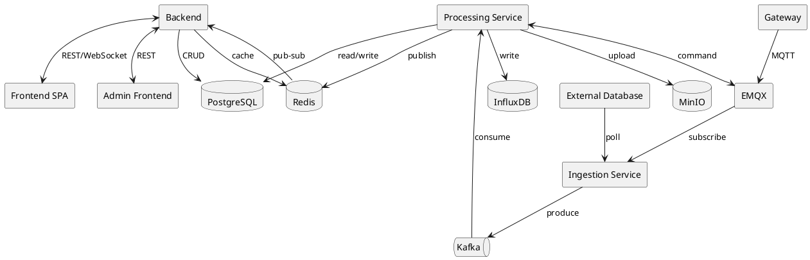

# Architecture

> Tổng quan kiến trúc. Đọc để hiểu hệ thống gồm những gì và data chạy qua các service nào.

## 1. Component diagram



> **Frontend:** **2 SPA độc lập, deploy riêng** — `x-frontend` (tenant user: Tenant Admin/Kỹ thuật viên/Nhân viên — dashboard, alert, command, report, quản lý tổ chức trong tenant) và `x-frontend-admin` (platform user: System Admin — quản lý tenant, quản lý platform_user; không cần realtime/dashboard/widget nên không dùng ECharts/react-grid-layout/socket.io). Cả 2 gọi chung 1 Backend API cho hầu hết endpoint, **riêng login/refresh/logout tách namespace path khác nhau** (`/api/v1/tenant/auth/*` và `/api/v1/platform/auth/*`, xem flow Auth) — vì cookie `refresh_token` scope theo Path chứ không phân biệt port, nếu dùng chung 1 path thì mở cả 2 app trong cùng trình duyệt sẽ ghi đè cookie của nhau (phát hiện thực tế lúc dev). Các endpoint còn lại (CRUD tenant, gateway...) vẫn dùng chung, Backend tự phân biệt `platform_user`/`tenant_user` theo `username` khi login.
>
> **Deploy:** Backend / Ingestion Service / Processing Service là **3 Spring Boot app độc lập** (3 deployable unit riêng, mỗi service 1 Docker image), không phải module trong 1 app. Deploy/scale riêng để tránh ảnh hưởng hiệu suất lẫn nhau — VD: Ingestion tải cao (nhiều gateway kết nối đồng thời) không kéo chậm Backend đang phục vụ user, Processing chạy report nặng không làm nghẽn consumer alert/command. 3 service **không gọi trực tiếp HTTP/RPC** với nhau — chỉ giao tiếp qua Kafka, Redis, hoặc đọc/viết chung PostgreSQL (shared-database pattern, chưa cần DB-per-service ở quy mô hiện tại).

## 2. Data flow

> Mô tả đường đi của data từ nguồn đến người dùng, qua những service nào và xử lý gì ở mỗi bước.
> "Frontend" trong các flow dưới đây (trừ Auth/RBAC) = `x-frontend` (tenant) — dashboard/alert/command/report là tính năng trong phạm vi 1 tenant, `x-frontend-admin` không tham gia các flow này.

### Flow: Gateway sensor data (MQTT ingestion)

```text
[Gateway] → [EMQX] → [Ingestion Service] → [Kafka: sensor-data-raw] → [Processing Service] → [InfluxDB] → [Redis pub/sub] → [Backend] → [Frontend]
```

| Bước | Service | Xử lý gì |
|------|---------|-----------|
| 1 | Gateway | Đọc **tất cả** chân INPUT (AI/DI) theo 1 chu kỳ polling cố định, đóng gói **batch** giá trị thành 1 JSON, publish 1 lần lên topic MQTT định danh bằng `mac_address` |
| 2 | EMQX | Nhận kết nối MQTT từ hàng nghìn gateway đồng thời, route message theo topic |
| 3 | Ingestion Service | Subscribe topic (Paho/Spring Integration MQTT), resolve `mac_address` → `gateway_id`/`tenant_id`/`tenant_node_id` (cache Redis `gw-resolve`, TTL 10', fallback query Postgres read-only nếu miss), **unbundle batch → 1 Kafka message/reading**, sinh `messageId` deterministic, publish Kafka `sensor-data-raw` (partition `tenant_id`+`gateway_id`) |
| 4 | Kafka | Buffer `sensor-data-raw`, đảm bảo at-least-once, decouple ingestion khỏi xử lý |
| 5 | Processing Service | Consume, dedup theo `messageId` (Redis `telemetry-dedup`, TTL 6h), validate schema, resolve `gateway_pin` theo `(gatewayId, type, pinNumber)` để lấy `metric`, bỏ qua pin có `enabled=false` hoặc không tìm thấy (log + skip, không throw) |
| 6 | Processing Service | Ghi InfluxDB measurement `sensor_reading` (tag `tenant_id`, `tenant_node_id`, `gateway_id`, `metric`, `pin_number`, `pin_type` — 2 tag pin bắt buộc để phân biệt khi nhiều pin chung metric); update `gateway.last_seen_at` trong Postgres |
| 7 | Processing Service | Đánh giá `alert_rule` theo `metric` tại node ngay sau khi ghi (chi tiết ở flow Alert — **Phase 6**); publish event realtime lên Redis pub/sub channel `realtime:{tenantId}:{tenantNodeId}` (payload kèm `pinNumber`/`pinType`) |
| 8 | Backend | `RedisRealtimeBridge` (`RedisMessageListenerContainer`, pattern `realtime:*`) nhận message, forward `SimpMessagingTemplate` vào STOMP topic `/topic/realtime/{tenantId}/{tenantNodeId}` (fan-out khi chạy nhiều instance nhờ mọi instance đều subscribe Redis) |
| 9 | Frontend | `@stomp/stompjs` client connect endpoint `/ws` (JWT ở header CONNECT), subscribe đúng topic theo site đang xem, khớp `pinNumber`/`pinType` để cập nhật đúng widget/card, render realtime |

**Contract STOMP/WebSocket (Backend ↔ Frontend), chốt khi làm trang Chi tiết Gateway:**

```
Endpoint: /ws (không dùng SockJS — browser hiện đại hỗ trợ WebSocket native đầy đủ)
CONNECT: header Authorization: Bearer {accessToken} — StompAuthChannelInterceptor validate JWT (JwtService),
         set Principal; SUBSCRIBE bị chặn nếu tenantId trong destination không khớp JWT hoặc
         ScopeService.canAccessNode(...) = false (tái dùng cơ chế phân quyền theo tenant_node đã có).
SUBSCRIBE: /topic/realtime/{tenantId}/{tenantNodeId}
Message payload (JSON, forward nguyên văn từ Redis): {gatewayId, metric, pinNumber, pinType, value, measuredAt}
```

**Contract MQTT (Gateway → EMQX), chốt ở Phase 3:**

```
Topic: gateway/{mac_address}/data   (QoS 1)
Payload:
{
  "measuredAt": "2026-08-12T09:41:00Z",
  "readings": [
    { "type": "AI", "pinNumber": 1, "value": 23.5 },
    { "type": "DI", "pinNumber": 1, "value": 1 }
  ]
}
```

`type` + `pinNumber` bắt buộc đi cùng nhau — unique constraint thật của `gateway_pin` là `(tenant_id, gateway_id, type, pin_number)`, riêng `pinNumber` không đủ phân biệt (VD `AI1` và `DI1` có thể trùng số).

**Contract Kafka `sensor-data-raw`** — JSON string thuần (không dùng Spring Kafka type-header serializer, tránh khoá theo Java class giữa 2 service độc lập version riêng); key partition = `"{tenantId}:{gatewayId}"`; header Kafka `correlation_id` = 1 UUID sinh ra mỗi batch MQTT (dùng chung cho mọi reading unbundle từ batch đó):

```json
{
  "messageId": "sha256-hex(mac+type+pinNumber+measuredAt)",
  "tenantId": 12, "gatewayId": 34, "tenantNodeId": 56,
  "macAddress": "AA:BB:CC:DD:EE:FF",
  "pinType": "AI", "pinNumber": 1, "value": 23.5,
  "measuredAt": "2026-08-12T09:41:00Z"
}
```

### Flow: External source data (polling)

```text
[Ingestion Service: scheduler] → [External PostgreSQL] → [Kafka: external-data-raw] → [Processing Service] → [InfluxDB] → [Redis pub/sub] → [Backend] → [Frontend]
```

**Quyết định chốt ở Phase 5** (khác Phase 3): chỉ hỗ trợ `connection_type=POSTGRESQL` (JDBC), field→metric mapping **không** qua `mapping_config` nữa mà qua `datastream.source_field` (datastream tạo thủ công, xem `DATABASE.md` § datastream) — vì vậy Ingestion không tự "map field → metric", chỉ publish field thô kèm `sourceField`, Processing Service mới resolve `Datastream`/`Metric`.

**Cập nhật ở `V12` — SQL là nguồn sự thật:** người dùng viết thẳng câu `SELECT`, hệ thống không dựng query từ config nữa. Lọc nằm trong `WHERE`, biến đổi (đổi đơn vị, gộp theo phút, join sang bảng khác) nằm trong `SELECT` — database bên kia đã có sẵn công cụ đầy đủ, không việc gì viết lại một phiên bản nghèo hơn. Đổi lại có 3 ràng buộc:

1. **`:cursor` bắt buộc** trong câu SQL — Ingestion thay bằng `?` và bind mốc đọc lần trước. Thiếu nó thì job quét lại toàn bộ bảng mỗi lần chạy, nên chặn ngay lúc lưu (`MISSING_CURSOR_PLACEHOLDER`).
2. **Phiên `READ ONLY`** thay cho allowlist định danh: `Connection.setReadOnly(true)` khiến chính Postgres bên kia từ chối mọi lệnh ghi, cộng `statement_timeout` và trần dòng. Đây là database của khách hàng chạy bằng credential họ tự nhập — mối đe dọa thật là câu ghi gõ nhầm chạy lặp theo cron, không phải injection.
3. **Cột dữ liệu suy từ `ResultSetMetaData`** (mọi cột trừ `timestampColumn`), không khai trước — thêm cột vào `SELECT` là có ngay field mới để gắn datastream.

| Bước | Service | Xử lý gì |
|------|---------|-----------|
| 1 | Ingestion Service | `@Scheduled` fixed-delay sweep (~15s, `ExternalSourceSchedulerService`) quét `external_source_job` có `next_run_at <= now()` — không cache Redis (khác `gw-resolve`) vì tần suất thấp, 1 query JPA/lần chạy là đủ rẻ |
| 2 | Ingestion Service | Decrypt `credential_encrypted` (AES-GCM, key `APP_ENCRYPTION_KEY`), mở `java.sql.Connection` JDBC thuần tới `external_source.connection_config` (không qua Hibernate — schema DB ngoài không biết trước) |
| 3 | Ingestion Service | Lấy `query_config.sql` (câu người dùng viết), thay mọi `:cursor` bằng `?` và bind mốc đọc lần trước; chạy trong phiên `READ ONLY` kèm `statement_timeout` + trần dòng. Không còn build query từ config, không còn allowlist định danh (`V12`) |
| 4 | Ingestion Service | Với mỗi row kết quả, **unbundle 1 Kafka message/field** (giống unbundle batch MQTT ở Phase 3) — field = mọi cột trong `ResultSetMetaData` trừ `timestampColumn`; sinh `messageId = sha256(jobId+sourceField+measuredAt)`, publish Kafka `external-data-raw` (partition `tenant_id`+`external_source_job_id`) |
| 5 | Kafka | Buffer `external-data-raw` riêng khỏi luồng gateway (đặc tính khác: theo cron, không push liên tục) |
| 6 | Processing Service | Consume, dedup theo `messageId` (tái dùng `telemetry-dedup` Redis key, TTL 6h — dedup logic không quan tâm nguồn), resolve `Datastream` theo `(sourceType=EXTERNAL_SOURCE_JOB, sourceId=externalSourceJobId, sourceField)` → `metric_id` → `Metric.code`; không tìm thấy → log + skip (giống pattern gateway_pin không khớp) |
| 7 | Processing Service | Ghi InfluxDB measurement `external_reading` (tag `tenant_id`, `tenant_node_id`, `source_id`=`externalSourceJobId`, `metric`) |
| 8 | Ingestion Service | Cập nhật `incremental_cursor = max(timestampColumn)`, `total_row_count += n`, `last_run_status=SUCCESS`, `next_run_at` (tính lại qua `cron-utils` từ `schedule_cron`); lỗi JDBC/connection → `last_run_status=FAILED`, `last_error`, vẫn advance `next_run_at` (log + skip, không throw, không retry-storm). Ghi thêm 1 dòng `external_source_job_run` mỗi lần chạy (`V12`) để Backend dựng dải nhịp chạy và biểu đồ số dòng/giờ |
| 9 | Processing Service | Publish event realtime lên Redis pub/sub channel `realtime:{tenantId}:{tenantNodeId}` — payload **khác** flow sensor: `{datastreamId, metric, value, measuredAt}` (không có `gatewayId/pinType/pinNumber` vì external không có pin) |
| 10 | Backend → Frontend | `RedisRealtimeBridge` forward nguyên văn (không phân biệt payload gateway/external) → STOMP topic `/topic/realtime/{tenantId}/{tenantNodeId}`; FE nhận payload có `datastreamId` thì match thẳng, không cần tra theo `gatewayId+pinType+pinNumber` |

**Contract Kafka `external-data-raw`** (JSON string thuần, giống `sensor-data-raw`):

```json
{
  "messageId": "sha256-hex(externalSourceJobId+sourceField+measuredAt)",
  "tenantId": 12, "tenantNodeId": 56, "externalSourceJobId": 7,
  "sourceField": "temperature_c", "value": 23.5,
  "measuredAt": "2026-08-13T09:41:00Z"
}
```

### Flow: Alert (threshold, đa kênh)

```text
[Processing Service: evaluate] → [PostgreSQL: alert state machine] → [Processing Service: notify] → [Email SMTP / Telegram Bot API]
                                                                    ↳ [Redis pub/sub] → [Backend] → [Frontend]
```

| Bước | Service | Xử lý gì |
|------|---------|-----------|
| 1 | Processing Service | Nhận trigger ngay sau khi ghi reading mới cho `metric` tại `tenant_node_id` (bước 7 flow sensor/external) |
| 2 | Processing Service | Resolve `alert_rule` đang `enabled=true` theo `(tenant_id, tenant_node_id, metric)` (cache Redis `alert-rules`, TTL 60s) |
| 3 | Processing Service | Đánh giá `conditions_json` (`>`, `<`, ...) so với giá trị mới; nếu vi phạm và chưa có alert mở (`uq_alert_open`) → tạo alert `PENDING`, `started_at = now()` |
| 4 | Processing Service | Nếu đã `PENDING` và đủ `duration_seconds` vi phạm liên tục → chuyển `ACTIVE`, set `triggered_at` |
| 5 | Processing Service | Đọc `alert_channel` của rule (EMAIL/TELEGRAM), gửi cảnh báo qua SMTP hoặc Telegram Bot API (token riêng theo channel) |
| 6 | Processing Service | Nếu hết vi phạm → chuyển `RECOVERED`, set `recovered_at` |
| 7 | PostgreSQL | Lưu lịch sử alert (state machine `PENDING → ACTIVE → RECOVERED`) để phục vụ Report |
| 8 | Processing Service → Backend | Publish trạng thái alert mới lên Redis pub/sub → push WebSocket để Dashboard hiển thị badge alert realtime |

### Flow: Command / Relay control (bật-tắt OUTPUT pin)

```text
[Frontend] → [Backend] → [PostgreSQL: command + outbox_event] → [Processing Service: publish] → [Kafka: gateway-commands] → [Processing Service: dispatch] → [EMQX] → [Gateway]
```

| Bước | Service | Xử lý gì |
|------|---------|-----------|
| 1 | Frontend | Kỹ thuật viên bật/tắt relay (OUTPUT pin) trên UI, gửi REST request kèm `idempotency_key` |
| 2 | Backend | Validate quyền (`@PreAuthorize` theo scope node), trong 1 transaction: ghi `command` (`status=PENDING`, `timeout_at`) + `outbox_event` (`aggregate_type=command`) |
| 3 | Processing Service | Outbox poller: poll `outbox_event` (`status IN (PENDING, FAILED)` theo `next_attempt_at`), publish Kafka topic = `event_type`, set `status=PUBLISHED` |
| 4 | Kafka | Buffer `gateway-commands`, đảm bảo lệnh không mất khi Processing Service tạm down |
| 5 | Processing Service | Command dispatcher: consume, resolve `parameters_json` (`pin`) → publish MQTT command xuống EMQX theo `gateway_id`, `command.status=DISPATCHED` |
| 6 | EMQX → Gateway | Gateway nhận lệnh, set relay, publish ACK ngược lại qua MQTT |
| 7 | Processing Service | Consume ACK qua EMQX, sanitize payload (`ack_payload_json`), update `command.status=ACKNOWLEDGED`, `gateway_pin.power_reported_state` |
| 8 | Processing Service | Timeout worker quét `command` có `status IN (PENDING, DISPATCHED)` và `timeout_at < now()` → set `TIMED_OUT` |
| 9 | Processing Service → Backend | Publish trạng thái command + `power_reported_state` mới lên Redis pub/sub → push WebSocket để UI cập nhật ngay |

**Contract MQTT Command/ACK (Processing Service ↔ Gateway qua EMQX), chốt ở Phase 7** — khác chiều với MQTT sensor data (Ingestion chỉ subscribe): Processing Service **vừa publish (lệnh) vừa subscribe (ACK)**, cần thêm MQTT client (Paho outbound + inbound) riêng cho Processing Service, độc lập với MQTT client của Ingestion Service.

```text
Topic lệnh: gateway/{mac_address}/command   (QoS 1, Processing Service publish)
Payload:
{
  "commandId": "3fa85f64-...",
  "pinType": "DO", "pinNumber": 2,
  "commandType": "TURN_ON"
}

Topic ACK: gateway/{mac_address}/ack        (QoS 1, Gateway publish, Processing Service subscribe)
Payload:
{
  "commandId": "3fa85f64-...",
  "pinType": "DO", "pinNumber": 2,
  "result": "ACK" | "NACK",
  "state": "ON" | "OFF"
}
```

`command.parameters_json` lưu `{"pinType":"DO","pinNumber":2}` — khớp unique key thật của `gateway_pin` (`type`+`pin_number`), không chỉ số `pin` đơn thuần. `commandId` = `command.id` (uuid), dùng luôn làm `correlation_id` xuyên Kafka `gateway-commands` (header) → MQTT — trace được 1 lệnh qua cả 2 network hop.

**Chính sách retry/timeout (giữ đơn giản, không exponential backoff):**

- `app.command.timeout-seconds` (Backend, mặc định 30s) — tính `timeout_at` lúc tạo `command`.
- Outbox poller (Processing Service): fixed-delay 3s.
- MQTT publish lỗi (EMQX down) → tăng `command.retry_count`, tối đa 3 lần cách nhau 2s, hết lượt → `status=FAILED`, `error` ghi lý do.
- Timeout worker: fixed-delay 5s, quét `status IN (PENDING, DISPATCHED) AND timeout_at < now()` → `TIMED_OUT`.

**Payload realtime Command** (Redis pub/sub → STOMP, cùng channel `realtime:{tenantId}:{tenantNodeId}` như flow sensor/external — FE phân biệt qua field `commandId` có mặt, match trực tiếp bằng `commandId` đã biết từ response lúc tạo lệnh, không cần `gatewayId`/`pinId`):

```json
{
  "commandId": "3fa85f64-...",
  "status": "ACKNOWLEDGED", "powerReportedState": "ON",
  "error": null
}
```

### Flow: Report generation

```text
[Frontend] → [Backend] → [PostgreSQL: report request] → [Processing Service] → [PostgreSQL + InfluxDB] → [MinIO] → [Backend] → [Frontend]
```

| Bước | Service | Xử lý gì |
|------|---------|-----------|
| 1 | Frontend | Người dùng chọn loại báo cáo (môi trường/vận hành/sự cố/năng suất), time range, multi-site/multi-sensor filter |
| 2 | Backend | Validate request, ghi report request (`status=PENDING`) vào Postgres, trả `report_id` ngay |
| 3 | Processing Service | Report worker nhận job, query đa chiều: metadata/tổ chức + lịch sử `alert` (nếu báo cáo sự cố) từ Postgres, sensor data từ InfluxDB (routing bucket theo time range) |
| 4 | Processing Service | Render theo template engine tương ứng loại báo cáo (PDF/Excel) |
| 5 | Processing Service | Upload file lên MinIO bucket `reports/{tenantId}/{yyyy}/{MM}/{reportId}.pdf`, lưu `object_key`/`checksum`/`file_size_bytes` + `status=READY` vào Postgres |
| 6 | Backend | Khi Frontend poll/nhận notify report `status=READY`, cấp presigned GET URL (~5′) để download |

### Flow: Auth / RBAC (đa cấp tenant)

```text
[Frontend] → [Backend] → [PostgreSQL: user + role] → [Redis: scope cache] → [Authorized request]
```

| Bước | Service | Xử lý gì |
|------|---------|-----------|
| 1 | Frontend | Submit `username`/`password` (login form) — `x-frontend` (tenant_user) gọi `/api/v1/tenant/auth/login`, `x-frontend-admin` (platform_user) gọi `/api/v1/platform/auth/login` (namespace path riêng để cookie `refresh_token` không đụng độ khi mở cả 2 app cùng trình duyệt lúc dev local) |
| 2 | Backend | Query `platform_user` hoặc `tenant_user` theo `username` (unique toàn cục), verify BCrypt |
| 3 | Backend | Issue JWT access token + refresh token, lưu `refresh_token.token_hash` (SHA-256), `expires_at` |
| 4 | Backend | Mỗi request sau đó: validate JWT, xác định `tenant_id`/`user_id` |
| 5 | Backend | Resolve `user_role_scope` → danh sách `role` + `tenant_node_id` được phân quyền (cache Redis `scope-sites`, TTL 60s) |
| 6 | Backend | Nếu `tenant_node_id IS NULL` → full-access toàn tenant; ngược lại dùng GiST index trên `tenant_node.path` (ltree) để lấy toàn bộ node con trong scope |
| 7 | Backend | `@PreAuthorize` chặn ở method level theo role + scope node đã resolve, trước khi chạm business logic |

## 3. Kafka topics

| Topic | Producer | Consumer | Partition key | Ghi chú |
|-------|----------|----------|----------------|---------|
| `sensor-data-raw` | Ingestion Service | Processing Service | `tenant_id` + `gateway_id` | Tách riêng khỏi external để rate-limit/backpressure độc lập |
| `external-data-raw` | Ingestion Service | Processing Service | `tenant_id` + `external_source_job_id` | Đặc tính khác sensor: theo cron, không phải push liên tục |
| `gateway-commands` | Processing Service (outbox poller) | Processing Service (command dispatcher) | `tenant_id` + `gateway_id` | Publish qua transactional outbox (`outbox_event`) trong cùng service, giữ đúng thứ tự lệnh/gateway |
| (dynamic theo `outbox_event.event_type`) | Processing Service | tuỳ consumer | — | Outbox là cơ chế dùng chung, hiện chỉ có Command dùng |
