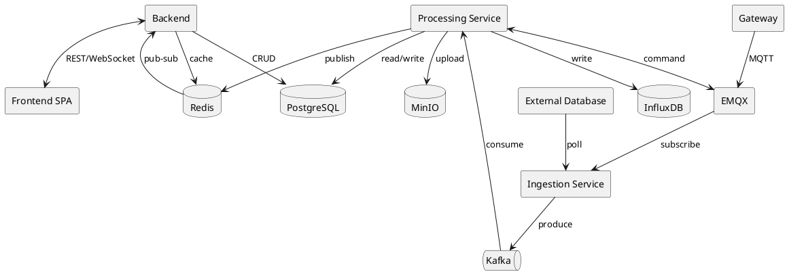

# Architecture

> Tổng quan kiến trúc. Đọc để hiểu hệ thống gồm những gì và data chạy qua các service nào.

## 1. Component diagram



> **Deploy:** Backend / Ingestion Service / Processing Service là **3 Spring Boot app độc lập** (3 deployable unit riêng, mỗi service 1 Docker image), không phải module trong 1 app. Deploy/scale riêng để tránh ảnh hưởng hiệu suất lẫn nhau — VD: Ingestion tải cao (nhiều gateway kết nối đồng thời) không kéo chậm Backend đang phục vụ user, Processing chạy report nặng không làm nghẽn consumer alert/command. 3 service **không gọi trực tiếp HTTP/RPC** với nhau — chỉ giao tiếp qua Kafka, Redis, hoặc đọc/viết chung PostgreSQL (shared-database pattern, chưa cần DB-per-service ở quy mô hiện tại).

## 2. Data flow

> Mô tả đường đi của data từ nguồn đến người dùng, qua những service nào và xử lý gì ở mỗi bước.

### Flow: Gateway sensor data (MQTT ingestion)

```text
[Gateway] → [EMQX] → [Ingestion Service] → [Kafka: sensor-data-raw] → [Processing Service] → [InfluxDB] → [Redis pub/sub] → [Backend] → [Frontend]
```

| Bước | Service | Xử lý gì |
|------|---------|-----------|
| 1 | Gateway | Đọc chân INPUT (AI/DI), đóng gói giá trị thành JSON, publish theo topic MQTT (định danh bằng `mac_address`) |
| 2 | EMQX | Nhận kết nối MQTT từ hàng nghìn gateway đồng thời, route message theo topic |
| 3 | Ingestion Service | Subscribe topic (Paho/Spring Integration MQTT), resolve `mac_address` → `gateway_id`/`tenant_id` (cache Redis `gw-resolve`, TTL 10'), publish Kafka `sensor-data-raw` (partition `tenant_id`+`gateway_id`) |
| 4 | Kafka | Buffer `sensor-data-raw`, đảm bảo at-least-once, decouple ingestion khỏi xử lý |
| 5 | Processing Service | Consume, dedup theo `messageId` (Redis `telemetry-dedup`, TTL 6h), validate schema, chuẩn hóa field theo `metric`, bỏ qua pin có `enabled=false` |
| 6 | Processing Service | Ghi InfluxDB measurement `sensor_reading` (tag `tenant_id`, `tenant_node_id`, `gateway_id`, `metric`); update `gateway.last_seen_at` trong Postgres |
| 7 | Processing Service | Đánh giá `alert_rule` theo `metric` tại node ngay sau khi ghi (chi tiết ở flow Alert); publish event realtime lên Redis pub/sub |
| 8 | Backend | Nhận qua Redis pub/sub (fan-out khi chạy nhiều instance), push STOMP/WebSocket tới client đang subscribe |
| 9 | Frontend | Render chart/value widget realtime trên Dashboard |

### Flow: External source data (polling)

```text
[Ingestion Service] → [External Database] → [Kafka: external-data-raw] → [Processing Service] → [InfluxDB] → [Redis pub/sub] → [Backend] → [Frontend]
```

| Bước | Service | Xử lý gì |
|------|---------|-----------|
| 1 | Ingestion Service | Scheduler đọc `schedule_cron`/`incremental_cursor` của từng `external_source_job`, tới hạn thì trigger job |
| 2 | Ingestion Service | Kết nối `external_source` bằng `connection_config` + credential (AES-GCM decrypt), chạy query theo `query_config`, lấy dữ liệu mới hơn `incremental_field`/cursor |
| 3 | Ingestion Service | Áp `filter_config` lọc dữ liệu, `mapping_config` map field → `metric`/`datastream`, publish Kafka `external-data-raw` (partition `tenant_id`+`external_source_job_id`) |
| 4 | Kafka | Buffer `external-data-raw` riêng khỏi luồng gateway (đặc tính khác: theo cron, không push liên tục) |
| 5 | Processing Service | Validate, chuẩn hóa, ghi InfluxDB measurement `external_reading` (tag `tenant_id`, `tenant_node_id`, `source_id`, `metric`) |
| 6 | Ingestion Service | Cập nhật `incremental_cursor`, `last_run_status`, `last_run_at`, `total_row_count` (hoặc `last_error` nếu FAILED) vào Postgres |
| 7 | Processing Service | Publish event realtime lên Redis pub/sub |
| 8 | Backend → Frontend | Giống bước 8-9 flow sensor — push realtime tới Dashboard đang xem node/datastream đó |

### Flow: Alert (threshold, đa kênh)

```text
[Processing Service: evaluate] → [PostgreSQL: alert state machine] → [Processing Service: notify] → [Email SMTP / Telegram Bot API]
                                                                    ↳ [Redis pub/sub] → [Backend] → [Frontend]
```

| Bước | Service | Xử lý gì |
|------|---------|-----------|
| 1 | Processing Service | Nhận trigger ngay sau khi ghi reading mới cho `metric` tại `tenant_node_id` (bước 7 flow sensor/external) |
| 2 | Processing Service | Resolve `alert_rule` đang `enabled=true` theo `(tenant_id, tenant_node_id, metric)` (cache Redis `alert-rules`, TTL 60s) |
| 3 | Processing Service | Đánh giá `conditions_json` (`>`, `<`, ...) so với giá trị mới; nếu vi phạm và chưa có alert mở (`uq_alert_open`) → tạo alert `PENDING`, `started_at = now()` |
| 4 | Processing Service | Nếu đã `PENDING` và đủ `duration_seconds` vi phạm liên tục → chuyển `ACTIVE`, set `triggered_at` |
| 5 | Processing Service | Đọc `alert_channel` của rule (EMAIL/TELEGRAM), gửi cảnh báo qua SMTP hoặc Telegram Bot API (token riêng theo channel) |
| 6 | Processing Service | Nếu hết vi phạm → chuyển `RECOVERED`, set `recovered_at` |
| 7 | PostgreSQL | Lưu lịch sử alert (state machine `PENDING → ACTIVE → RECOVERED`) để phục vụ Report |
| 8 | Processing Service → Backend | Publish trạng thái alert mới lên Redis pub/sub → push WebSocket để Dashboard hiển thị badge alert realtime |

### Flow: Command / Relay control (bật-tắt OUTPUT pin)

```text
[Frontend] → [Backend] → [PostgreSQL: command + outbox_event] → [Processing Service: publish] → [Kafka: gateway-commands] → [Processing Service: dispatch] → [EMQX] → [Gateway]
```

| Bước | Service | Xử lý gì |
|------|---------|-----------|
| 1 | Frontend | Kỹ thuật viên bật/tắt relay (OUTPUT pin) trên UI, gửi REST request kèm `idempotency_key` |
| 2 | Backend | Validate quyền (`@PreAuthorize` theo scope node), trong 1 transaction: ghi `command` (`status=PENDING`, `timeout_at`) + `outbox_event` (`aggregate_type=command`) |
| 3 | Processing Service | Outbox poller: poll `outbox_event` (`status IN (PENDING, FAILED)` theo `next_attempt_at`), publish Kafka topic = `event_type`, set `status=PUBLISHED` |
| 4 | Kafka | Buffer `gateway-commands`, đảm bảo lệnh không mất khi Processing Service tạm down |
| 5 | Processing Service | Command dispatcher: consume, resolve `parameters_json` (`pin`) → publish MQTT command xuống EMQX theo `gateway_id`, `command.status=DISPATCHED` |
| 6 | EMQX → Gateway | Gateway nhận lệnh, set relay, publish ACK ngược lại qua MQTT |
| 7 | Processing Service | Consume ACK qua EMQX, sanitize payload (`ack_payload_json`), update `command.status=ACKNOWLEDGED`, `gateway_pin.power_reported_state` |
| 8 | Processing Service | Timeout worker quét `command` có `status IN (PENDING, DISPATCHED)` và `timeout_at < now()` → set `TIMED_OUT` |
| 9 | Processing Service → Backend | Publish trạng thái command + `power_reported_state` mới lên Redis pub/sub → push WebSocket để UI cập nhật ngay |

### Flow: Report generation

```text
[Frontend] → [Backend] → [PostgreSQL: report request] → [Processing Service] → [PostgreSQL + InfluxDB] → [MinIO] → [Backend] → [Frontend]
```

| Bước | Service | Xử lý gì |
|------|---------|-----------|
| 1 | Frontend | Người dùng chọn loại báo cáo (môi trường/vận hành/sự cố/năng suất), time range, multi-site/multi-sensor filter |
| 2 | Backend | Validate request, ghi report request (`status=PENDING`) vào Postgres, trả `report_id` ngay |
| 3 | Processing Service | Report worker nhận job, query đa chiều: metadata/tổ chức + lịch sử `alert` (nếu báo cáo sự cố) từ Postgres, sensor data từ InfluxDB (routing bucket theo time range) |
| 4 | Processing Service | Render theo template engine tương ứng loại báo cáo (PDF/Excel) |
| 5 | Processing Service | Upload file lên MinIO bucket `reports/{tenantId}/{yyyy}/{MM}/{reportId}.pdf`, lưu `object_key`/`checksum`/`file_size_bytes` + `status=READY` vào Postgres |
| 6 | Backend | Khi Frontend poll/nhận notify report `status=READY`, cấp presigned GET URL (~5′) để download |

### Flow: Auth / RBAC (đa cấp tenant)

```text
[Frontend] → [Backend] → [PostgreSQL: user + role] → [Redis: scope cache] → [Authorized request]
```

| Bước | Service | Xử lý gì |
|------|---------|-----------|
| 1 | Frontend | Submit `username`/`password` (login form) |
| 2 | Backend | Query `platform_user` hoặc `tenant_user` theo `username` (unique toàn cục), verify BCrypt |
| 3 | Backend | Issue JWT access token + refresh token, lưu `refresh_token.token_hash` (SHA-256), `expires_at` |
| 4 | Backend | Mỗi request sau đó: validate JWT, xác định `tenant_id`/`user_id` |
| 5 | Backend | Resolve `user_role_scope` → danh sách `role` + `tenant_node_id` được phân quyền (cache Redis `scope-sites`, TTL 60s) |
| 6 | Backend | Nếu `tenant_node_id IS NULL` → full-access toàn tenant; ngược lại dùng GiST index trên `tenant_node.path` (ltree) để lấy toàn bộ node con trong scope |
| 7 | Backend | `@PreAuthorize` chặn ở method level theo role + scope node đã resolve, trước khi chạm business logic |

## 3. Kafka topics

| Topic | Producer | Consumer | Partition key | Ghi chú |
|-------|----------|----------|----------------|---------|
| `sensor-data-raw` | Ingestion Service | Processing Service | `tenant_id` + `gateway_id` | Tách riêng khỏi external để rate-limit/backpressure độc lập |
| `external-data-raw` | Ingestion Service | Processing Service | `tenant_id` + `external_source_job_id` | Đặc tính khác sensor: theo cron, không phải push liên tục |
| `gateway-commands` | Processing Service (outbox poller) | Processing Service (command dispatcher) | `tenant_id` + `gateway_id` | Publish qua transactional outbox (`outbox_event`) trong cùng service, giữ đúng thứ tự lệnh/gateway |
| (dynamic theo `outbox_event.event_type`) | Processing Service | tuỳ consumer | — | Outbox là cơ chế dùng chung, hiện chỉ có Command dùng |
