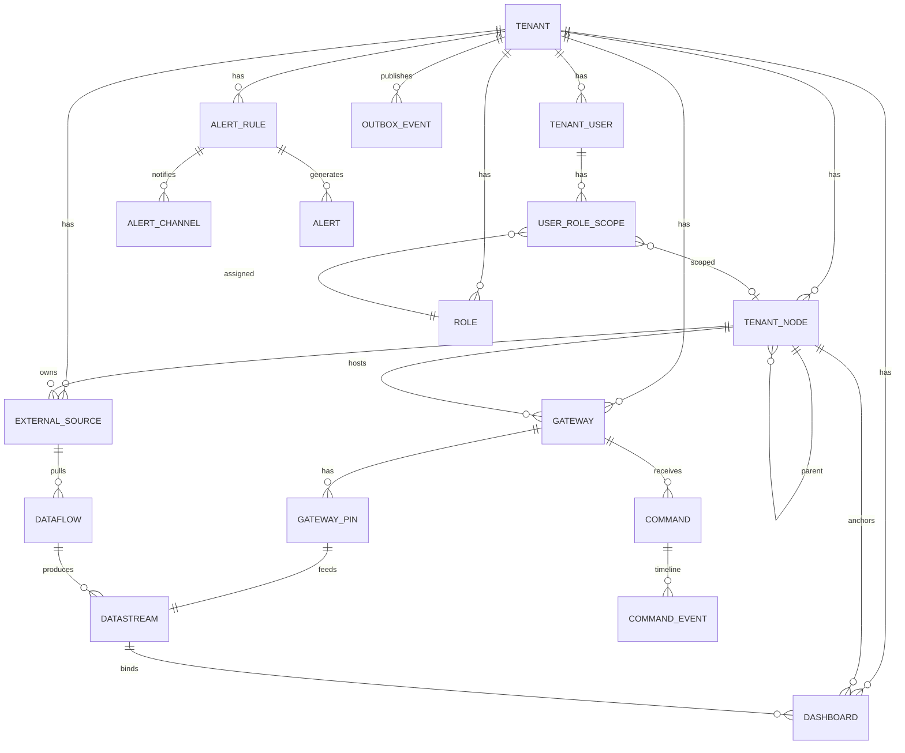

# Database

> Nguồn schema duy nhất là **Flyway**; Hibernate chạy `ddl-auto: validate`.
> Tenant isolation: **Hibernate multi-tenancy DISCRIMINATOR** (bỏ RLS).
> Migration đã squash thành baseline (2026-06-30): `V1__baseline_schema.sql`; các thay đổi sau baseline theo từng version riêng (`V2__auth_seed.sql`, `V3__refresh_token_platform_user.sql`, `V4__phase2_metric_seed.sql`, `V5__dev_seed_credentials.sql`, `V6__backfill_datastream_from_gateway_pin.sql`, `V7__phase4_dashboard_template_seed.sql`, `V8__weather_and_gas_metric_seed.sql`, `V9__platform_user_soft_delete.sql`, `V10__tenant_node_enabled.sql`, `V11__external_source_polling.sql`...).

## 1. ERD

Các thực thể trong hệ thống và mối quan hệ giữa chúng.

| Thực thể | Mô tả |
|----------|-------|
| tenant | Tổ chức khách hàng |
| platform_user | Tài khoản quản trị nền tảng |
| tenant_user | Người dùng trong tenant |
| refresh_token | Token làm mới JWT |
| role | Vai trò |
| user_role_scope | Phân quyền user ↔ role + scope node |
| tenant_node | Cây tổ chức: TENANT_ROOT → BRANCH → PRODUCTION_AREA → SITE |
| gateway | Gateway IoT (Advantech) |
| gateway_pin | Chân vật lý trên gateway (INPUT=đo / OUTPUT=điều khiển) |
| external_source | Nguồn dữ liệu ngoài (kết nối DB khác) |
| external_source_job | Task scrape/pull dữ liệu từ external_source |
| dashboard | Bảng điều khiển (widget JSONB) |
| dashboard_template | Template dashboard (SYSTEM/CUSTOM) |
| datastream | Kênh dữ liệu/điều khiển (neo vào gateway_pin) |
| alert_rule | Rule cảnh báo (SENSOR/GATEWAY) |
| alert_channel | Kênh nhận cảnh báo (EMAIL/TELEGRAM) |
| alert | Instance cảnh báo đang mở/closed |
| command | Lệnh điều khiển gateway |
| outbox_event | Transactional outbox (Kafka) |

| Quan hệ | Loại | Mô tả |
|----------|------|-------|
| tenant — tenant_user | 1-n | Nhiều user thuộc 1 tenant |
| tenant — tenant_node | 1-n | Cây tổ chức trong tenant |
| tenant — external_source | 1-n | External source thuộc tenant |
| tenant_node — tenant_node | 1-n (self-ref) | Parent-child (ltree) |
| tenant_node — gateway | 1-n | Gateway thuộc SITE |
| tenant_node — external_source | 1-n | External source thuộc node |
| gateway — gateway_pin | 1-n | Chân vật lý trên gateway |
| gateway_pin — datastream | 1-1 | Datastream neo vào gateway_pin (sensor) |
| external_source — external_source_job | 1-n | Job scrape từ external_source |
| external_source_job — datastream | 1-n | Datastream neo vào external_source_job |
| datastream — dashboard | 1-n (qua JSONB) | Widget bind datastream |
| alert_rule — alert_channel | 1-n | Nhiều kênh nhận 1 rule |
| alert_rule — alert | 1-n | Rule tạo nhiều alert |
| outbox_event | — | Transactional outbox, publish Kafka |



## 2. Các bảng

> Mỗi bảng ghi rõ đại diện cho gì (bảng dữ liệu chính, bảng kết nối, bảng log, ...).
> Cột chuẩn `id bigint PK auto increment, tenant_id bigint NOT NULL, created_at/updated_at timestamptz, created_by/updated_by bigint`.

### tenant
**Vì sao cần:** Tổ chức khách hàng. Không `@TenantId` (self-referencing platform context).

| Column | Type | Constraint | Mô tả |
|--------|------|------------|-------|
| id | bigint | PK auto increment | Tenant ID |
| name | varchar | NOT NULL | Tên hiển thị |
| email | varchar | NOT NULL | Email liên hệ |
| status | varchar | NOT NULL, CHECK IN ('ACTIVE','LOCKED') | |
| settings_json | jsonb | | Cấu hình tenant |
| created_at | timestamptz | NOT NULL | |
| updated_at | timestamptz | NOT NULL | |
| deleted_at | timestamptz | | Soft delete |

- `name` đồng bộ tự động với `tenant_node` (`node_type='TENANT_ROOT'`) `.name` khi Tenant Admin đổi tên ở trang Tổ chức (`TenantNodeServiceImpl.rename()` cập nhật luôn `tenant.name` cùng transaction) — 1 chiều `tenant_node → tenant`, không có chiều ngược (chưa có endpoint platform sửa `tenant.name` trực tiếp).
- `status = LOCKED` chặn toàn bộ `tenant_user` thuộc tenant đăng nhập và refresh token (`AuthServiceImpl.loginAsTenantUser()`/`refresh()`).

### platform_user
**Vì sao cần:** Tài khoản quản trị nền tảng. Không `tenant_id` → cross-tenant.

| Column | Type | Constraint | Mô tả |
|--------|------|------------|-------|
| id | bigint | PK auto increment | Platform user ID |
| username | varchar | NOT NULL, UNIQUE lower(username) trong số user chưa xóa (partial index `WHERE deleted_at IS NULL`, đổi từ unique toàn cục ở `V9__platform_user_soft_delete.sql`) | Định danh đăng nhập — username được tái sử dụng sau khi user cũ bị xóa |
| full_name | varchar | NOT NULL | Họ tên |
| email | varchar | NULLABLE, UNIQUE toàn cục | Email liên hệ — optional lúc tạo, FE gửi `null` thay vì `''` để tránh đụng UNIQUE khi nhiều user cùng bỏ trống |
| password_hash | varchar | NOT NULL | BCrypt |
| status | varchar | NOT NULL DEFAULT 'ACTIVE', CHECK IN ('ACTIVE','LOCKED') | |
| created_at | timestamptz | NOT NULL | |
| updated_at | timestamptz | NOT NULL | |
| deleted_at | timestamptz | | Soft delete — map vào Entity qua `@SQLRestriction("deleted_at IS NULL")` (từ V9, trước đó cột có trong DB nhưng chưa map JPA) |

### tenant_user
**Vì sao cần:** Người dùng trong tenant. Đăng nhập bằng `username` (unique toàn cục).

| Column | Type | Constraint | Mô tả |
|--------|------|------------|-------|
| id | bigint | PK auto increment | User ID |
| tenant_id | bigint | NOT NULL, FK tenant | Tenant sở hữu |
| username | varchar | NOT NULL, UNIQUE lower(username) toàn cục | Định danh đăng nhập |
| full_name | varchar | NOT NULL | Họ tên |
| email | varchar | NULLABLE, UNIQUE lower(email) toàn cục | Email liên hệ |
| password_hash | varchar | NOT NULL | BCrypt |
| status | varchar | NOT NULL, CHECK IN ('ACTIVE','LOCKED') | |
| created_at | timestamptz | NOT NULL | |
| created_by | bigint | | |
| updated_at | timestamptz | NOT NULL | |
| updated_by | bigint | | |
| deleted_at | timestamptz | | Soft delete |

### refresh_token
**Vì sao cần:** Token làm mới JWT. Dùng chung cho cả `tenant_user` và `platform_user` (2 cột user rời nhau, đúng 1 trong 2 NOT NULL).

| Column | Type | Constraint | Mô tả |
|--------|------|------------|-------|
| id | bigint | PK auto increment | |
| tenant_id | bigint | NULLABLE, FK tenant | NULL = token của platform_user |
| user_id | bigint | NULLABLE, FK tenant_user | NULL = token của platform_user |
| platform_user_id | bigint | NULLABLE, FK platform_user | NULL = token của tenant_user |
| token_hash | varchar | NOT NULL, UNIQUE | SHA-256 (không lưu token gốc) |
| expires_at | timestamptz | NOT NULL | 30 ngày |
| revoked_at | timestamptz | | NULL = còn hiệu lực |
| created_at | timestamptz | NOT NULL | |

- CHECK: đúng 1 trong 2 — `(tenant_id, user_id NOT NULL và platform_user_id NULL)` hoặc `(tenant_id, user_id NULL và platform_user_id NOT NULL)`.
- Index `(tenant_id, user_id) WHERE user_id IS NOT NULL`, `(platform_user_id) WHERE platform_user_id IS NOT NULL`, cả 2 kèm `WHERE revoked_at IS NULL` (tra token còn hiệu lực).
- Rotation: mỗi lần refresh → revoke token cũ (`revoked_at = now()`) + insert token mới. Logout = revoke.

### platform_role
**Vì sao cần:** Vai trò cho quản trị viên nền tảng (cross-tenant).

| Column | Type | Constraint | Mô tả |
|--------|------|------------|-------|
| id | bigint | PK auto increment | |
| name | varchar | NOT NULL, UNIQUE | Tên hiển thị |
| value | varchar | NOT NULL, UNIQUE | Mã role (e.g. PLATFORM_ADMIN, SUPPORT) |
| created_at | timestamptz | NOT NULL | |

- Seed: `PLATFORM_ADMIN`.

### tenant_role
**Vì sao cần:** Vai trò cho người dùng trong tenant.

| Column | Type | Constraint | Mô tả |
|--------|------|------------|-------|
| id | bigint | PK auto increment | |
| tenant_id | bigint | NOT NULL, FK tenant | |
| name | varchar | NOT NULL | Tên hiển thị |
| value | varchar | NOT NULL | Mã role (e.g. TENANT_ADMIN, MANAGER, OPERATOR, VIEWER) |
| created_at | timestamptz | NOT NULL | |
| created_by | bigint | | |

- Unique `(tenant_id, value)`.
- Seed per-tenant: `TENANT_ADMIN`, `MANAGER`, `OPERATOR`, `VIEWER`.

### user_role_scope
**Vì sao cần:** Phân quyền user ↔ tenant_role + scope node. 1 user có thể phụ trách nhiều node.

| Column | Type | Constraint | Mô tả |
|--------|------|------------|-------|
| id | bigint | PK auto increment | |
| tenant_id | bigint | NOT NULL, FK tenant | |
| user_id | bigint | NOT NULL, FK tenant_user | |
| role_id | bigint | NOT NULL, FK tenant_role | |
| tenant_node_id | bigint | NULLABLE, FK tenant_node | NULL = full-access toàn tenant |

- Unique `(tenant_id, user_id, role_id, COALESCE(tenant_node_id, 0))`.
- Service chặn xóa scope làm tenant mất Tenant Admin active cuối cùng.

### tenant_node
**Vì sao cần:** Cây tổ chức: TENANT_ROOT → BRANCH → PRODUCTION_AREA → SITE. Dùng ltree.

| Column | Type | Constraint | Mô tả |
|--------|------|------------|-------|
| id | bigint | PK auto increment | |
| tenant_id | bigint | NOT NULL, FK tenant | |
| parent_id | bigint | NULLABLE, FK tenant_node(self) | NULL cho TENANT_ROOT |
| node_type | varchar | NOT NULL, CHECK IN ('TENANT_ROOT','BRANCH','PRODUCTION_AREA','SITE') | |
| name | varchar | NOT NULL | |
| path | ltree | NOT NULL | Materialized path |
| depth | int | NOT NULL | Độ sâu |
| enabled | boolean | NOT NULL DEFAULT true | `V10` — false = tổ chức "tắt": FE ẩn/đánh dấu, chặn tạo node con mới; KHÔNG chặn data/alert đang chạy qua gateway/datastream bên dưới (ngoài phạm vi bảng này) |
| created_at | timestamptz | NOT NULL | |
| created_by | bigint | | |
| updated_at | timestamptz | NOT NULL | |
| updated_by | bigint | | |
| deleted_at | timestamptz | | Soft delete |

- Composite FK parent `(tenant_id, parent_id) → (tenant_id, id)`.
- Check thứ bậc `TENANT_ROOT → BRANCH → PRODUCTION_AREA → SITE`.
- GiST index trên `path`.
- Label ltree = `id` viết `-`→`_`; `path = parent.path || '.' || label`.

### gateway
**Vì sao cần:** Gateway IoT (Advantech). MAC = định danh ngoài.

| Column | Type | Constraint | Mô tả |
|--------|------|------------|-------|
| id | bigint | PK auto increment | |
| tenant_id | bigint | NOT NULL, FK tenant | |
| tenant_node_id | bigint | NULLABLE, FK tenant_node | NULL = gateway mồ côi |
| name | varchar | NOT NULL | Metadata |
| mac_address | varchar(32) | NOT NULL, UNIQUE toàn platform | MAC = định danh ngoài (wire/MQTT) |
| last_seen_at | timestamptz | | Lần cuối nhận heartbeat/data từ gateway |
| created_at | timestamptz | NOT NULL | |
| created_by | bigint | | |
| updated_at | timestamptz | NOT NULL | |
| updated_by | bigint | | |
| deleted_at | timestamptz | | Soft delete |

- Composite FK `(tenant_id, tenant_node_id) → tenant_node`.
- Unique `(tenant_id, id)`.
- `last_seen_at`: JPA `updatable=false` (chỉ realtime ghi).

### gateway_pin
**Vì sao cần:** Chân vật lý trên gateway. INPUT=đo (cảm biến) / OUTPUT=điều khiển (relay).

| Column | Type | Constraint | Mô tả |
|--------|------|------------|-------|
| id | bigint | PK auto increment | |
| tenant_id | bigint | NOT NULL, FK tenant | |
| gateway_id | bigint | NOT NULL, FK gateway ON DELETE CASCADE | |
| direction | varchar | NOT NULL, CHECK IN ('INPUT','OUTPUT') | INPUT=cảm biến, OUTPUT=relay |
| type | varchar | NOT NULL, CHECK IN ('AI','DI','DO','AO') | Khớp direction |
| name | varchar | NOT NULL | Metadata (nhãn hiển thị) |
| metric_id | bigint | NULLABLE, INPUT MUST NOT NULL, OUTPUT = NULL | FK metric |
| pin_number | int | NOT NULL | Số chân vật lý (AI1.., DO1..) |
| power_desired_state | varchar | NULLABLE, CHECK IN ('ON','OFF') | OUTPUT only — ý muốn |
| power_reported_state | varchar | NULLABLE, CHECK IN ('ON','OFF') | OUTPUT only — realtime set khi ACK |
| enabled | boolean | NOT NULL DEFAULT true | false = tạm ngưng, bỏ qua dữ liệu từ pin này |
| created_at | timestamptz | NOT NULL | |
| created_by | bigint | | |
| updated_at | timestamptz | NOT NULL | |
| updated_by | bigint | | |

- Composite FK `(tenant_id, gateway_id) → gateway`. Unique `(tenant_id, id)`.
- Unique **`uq_gateway_pin (tenant_id, gateway_id, type, pin_number)`**.
- CHECK: INPUT ⇒ `metric_id NOT NULL` & power* NULL; OUTPUT ⇒ `pin_number NOT NULL` & metric NULL.
- 1 gateway_pin → 1 datastream (single source of truth).

### metric
**Vì sao cần:** Master data kiểu đo. Chia sẻ chéo tenant (system data).

| Column | Type | Constraint | Mô tả |
|--------|------|------------|-------|
| id | bigint | PK auto increment | |
| code | varchar | NOT NULL, UNIQUE | temperature, humidity, pressure... |
| name | varchar | NOT NULL | Nhiệt độ, Độ ẩm, Áp suất... |
| unit | varchar | NOT NULL | °C, %RH, hPa... |
| data_type | varchar | NOT NULL, CHECK IN ('NUMBER','BOOLEAN','STRING') | |
| min_value | double | | Range hợp lệ optional |
| max_value | double | | |
| created_at | timestamptz | NOT NULL | |

- System seed data: temperature, humidity, pressure, pm25, co2, light, voltage, current, power... — seed ở `V4__phase2_metric_seed.sql` (Phase 2).

### external_source
**Vì sao cần:** Kết nối CSDL ngoài. Mỗi source = 1 nguồn dữ liệu có Dashboard riêng (xem bảng `dashboard`).

| Column | Type | Constraint | Mô tả |
|--------|------|------------|-------|
| id | bigint | PK auto increment | |
| tenant_id | bigint | NOT NULL, FK tenant | |
| tenant_node_id | bigint | NOT NULL, FK tenant_node | Source thuộc node — **bất kỳ cấp nào** (TENANT_ROOT/BRANCH/PRODUCTION_AREA/SITE), khác Gateway (chỉ SITE) |
| name | varchar | NOT NULL | Tên hiển thị |
| connection_type | varchar | NOT NULL, CHECK IN ('POSTGRESQL') — `V11` | Loại kết nối. Chỉ PostgreSQL ở Phase 5, mở rộng MySQL/MongoDB bằng migration sau |
| connection_config | jsonb | NOT NULL | `{host, port, database, sslMode}` |
| credential_encrypted | text | NOT NULL | AES-GCM encrypt JSON `{username, password}` (key `app.encryption.key`/env `APP_ENCRYPTION_KEY`, dùng chung 1 key toàn platform) — API không bao giờ trả giá trị decrypt |
| last_sync_status | varchar | | Trạng thái sync gần nhất |
| last_sync_at | timestamptz | | Lần sync gần nhất |
| last_error | text | | Lỗi gần nhất |
| created_at | timestamptz | NOT NULL | |
| created_by | bigint | | |
| updated_at | timestamptz | NOT NULL | |
| updated_by | bigint | | |
| deleted_at | timestamptz | | Soft delete |

- Composite FK `(tenant_id, tenant_node_id) → tenant_node`.
- Unique `(tenant_id, id)`.
- Xóa bị chặn 409 nếu còn `external_source_job` (giống `NODE_HAS_CHILDREN`).

### external_source_job
**Vì sao cần:** Task scrape/pull dữ liệu từ external_source. Mỗi job chạy 1 logic lọc/map riêng.

| Column | Type | Constraint | Mô tả |
|--------|------|------------|-------|
| id | bigint | PK auto increment | |
| tenant_id | bigint | NOT NULL, FK tenant | |
| external_source_id | bigint | NOT NULL, FK external_source ON DELETE CASCADE | Nguồn dữ liệu |
| name | varchar | NOT NULL | Tên job |
| query_config | jsonb | NOT NULL | `{table, timestampColumn, valueColumns: []}` — table/column name validate allowlist `^[a-zA-Z_][a-zA-Z0-9_]{0,62}$` cả lúc tạo (x-backend) lẫn lúc build query (x-ingestion-service), vì identifier không parameterize được trong JDBC |
| filter_config | jsonb | | `[{column, operator, value}]`, `operator` ∈ `=,!=,>,<,>=,<=` — value bind qua `?`, column validate cùng allowlist trên |
| mapping_config | jsonb | | **Không dùng ở Phase 5** — field→metric mapping thật nằm ở `datastream.source_field`/`metric_id` (xem bảng `datastream`), cột này giữ lại reserved cho transform rule (type coercion) nếu cần sau |
| schedule_cron | varchar | | Cron expression 5 field chuẩn (VD `*/5 * * * *`), parse bằng `cron-utils` (x-ingestion-service), validate cú pháp ngay lúc tạo job (x-backend) |
| incremental_field | varchar | | Cột thời gian dùng để incremental reading |
| incremental_cursor | varchar | | Giá trị cursor hiện tại (timestamp hoặc value) |
| total_row_count | bigint | NOT NULL DEFAULT 0 | Thống kê số dòng luỹ kế |
| last_run_status | varchar | NULLABLE, CHECK IN ('RUNNING','SUCCESS','FAILED') | NULL = chưa chạy |
| last_run_at | timestamptz | | Lần chạy gần nhất |
| next_run_at | timestamptz | | Lần chạy tiếp theo |
| last_error | text | | Lỗi gần nhất |
| created_at | timestamptz | NOT NULL | |
| created_by | bigint | | |
| updated_at | timestamptz | NOT NULL | |
| updated_by | bigint | | |
| deleted_at | timestamptz | | Soft delete |

- Composite FK `(tenant_id, external_source_id) → external_source`.
- Unique `(tenant_id, id)`.
- Scheduler: `x-ingestion-service` chạy 1 `@Scheduled` fixed-delay sweep (~15s) quét `next_run_at <= now()`, không cache Redis (khác `gw-resolve`) vì tần suất thấp (theo lịch job, không phải mỗi message MQTT). Sửa `query_config`/`filter_config`/`schedule_cron` → reset `incremental_cursor = NULL` (cursor cũ có thể không còn hợp lệ với query mới).
- Xóa bị chặn 409 nếu còn `datastream` gắn vào (`source_type='EXTERNAL_SOURCE_JOB', source_id=job.id`).

### dashboard
**Vì sao cần:** Bảng điều khiển. Widget + layout lưu JSONB (`layout_json`).

| Column | Type | Constraint | Mô tả |
|--------|------|------------|-------|
| id | bigint | PK auto increment | |
| tenant_id | bigint | NOT NULL, FK tenant | |
| user_id | bigint | NOT NULL, FK tenant_user | Chủ board |
| tenant_node_id | bigint | NULLABLE, FK tenant_node | Anchor node (site) — khi `external_source_id NOT NULL` thì đây là node của source đó (denormalize để tái dùng `@nodeScope.canAccess`) |
| external_source_id | bigint | NULLABLE, FK external_source — `V11` | NOT NULL = board riêng theo 1 nguồn (layout riêng, không gộp với board của node); NULL = board theo node (site) như trước |
| name | varchar | NOT NULL | Tên board |
| layout_json | jsonb | NOT NULL | `{widgets:[{id,type,layout,title,binding,config}]}` |
| created_at | timestamptz | NOT NULL | |
| created_by | bigint | | |
| updated_at | timestamptz | NOT NULL | |
| updated_by | bigint | | |

- Unique `(tenant_id, user_id, tenant_node_id, COALESCE(external_source_id, 0))` — `V11` đổi từ unique `(tenant_id, user_id, tenant_node_id)` cũ, vì Postgres coi nhiều `NULL` là phân biệt nên phải `COALESCE` (giống pattern `uq_user_role_scope`).
- WidgetType: VALUE/LINE/SWITCH (gắn nguồn); DEVICE_COUNT/DEVICES_ONLINE/DEVICE_TABLE/EVENT_* (tổng hợp theo node) — **board theo nguồn (`external_source_id NOT NULL`) chỉ cho phép VALUE/LINE**, không có khái niệm gateway/subtree để tổng hợp DEVICE_COUNT/DEVICES_ONLINE.
- Điều hướng FE (từ `V11`): vào node không phải SITE → card-grid flatten toàn bộ subtree (tất cả `external_source` + tất cả `SITE` bên dưới, bất kể sâu bao nhiêu cấp) thay vì dashboard trực tiếp; vào SITE → 2 tab "Xem site" (board theo node, như cũ) / "Xem theo nguồn" (card các source gắn tại chính site đó → board riêng từng nguồn).

### dashboard_template
**Vì sao cần:** Template dashboard. Global seed data — mọi tenant đều dùng được. Template chỉ định loại widget + metric, khi áp dụng vào node thì hệ thống tự tìm tất cả datastream có metric đó và tạo widget cho từng datastream.

| Column | Type | Constraint | Mô tả |
|--------|------|------------|-------|
| id | bigint | PK auto increment | |
| name | varchar | NOT NULL | |
| description | varchar | | |
| layout_json | jsonb | NOT NULL | Danh sách widget template: `[{widget_type, metric, config}]` — mỗi entry là 1 loại widget cần tạo |
| created_at | timestamptz | NOT NULL | |
| created_by | bigint | | |
| updated_at | timestamptz | NOT NULL | |
| updated_by | bigint | | |

**logic áp dụng:**
```
Template layout = [
  { widget_type: "LINE", metric: "temperature", config: {...} },
  { widget_type: "VALUE", metric: "humidity", config: {...} }
]

Áp dụng vào node X → hệ thống query:
  SELECT * FROM datastream WHERE tenant_node_id = X AND metric = 'temperature'
  → Mỗi datastream = 1 widget LINE trong dashboard
```

### datastream
**Vì sao cần:** Kênh dữ liệu/điều khiển kiểu Blynk. Nguồn từ gateway_pin hoặc external_source_job.

| Column | Type | Constraint | Mô tả |
|--------|------|------------|-------|
| id | bigint | PK auto increment | |
| tenant_id | bigint | NOT NULL, FK tenant | |
| tenant_node_id | bigint | NOT NULL, FK tenant_node | Anchor node |
| name | varchar | NOT NULL | Tên kênh |
| metric_id | bigint | NOT NULL, FK metric | Kiểu đo (temperature, humidity...) |
| source_type | varchar | NOT NULL, CHECK IN ('GATEWAY_PIN','EXTERNAL_SOURCE_JOB') | Loại nguồn |
| source_id | bigint | NOT NULL | ID nguồn (gateway_pin hoặc external_source_job) |
| source_field | varchar | NULLABLE — `V11`, CHECK (GATEWAY_PIN ⇒ NULL, EXTERNAL_SOURCE_JOB ⇒ NOT NULL) | Field/cột trong `query_config.valueColumns` mà datastream này bind vào — cần vì 1 `external_source_job` có thể sinh nhiều datastream (khác gateway_pin luôn 1-1) |
| created_at | timestamptz | NOT NULL | |
| created_by | bigint | | |
| updated_at | timestamptz | NOT NULL | |
| updated_by | bigint | | |

- CHECK: source_type + source_id hợp lệ.
- Composite FK `(tenant_id, tenant_node_id) → tenant_node`.
- Unique `(tenant_id, tenant_node_id, lower(name))` = `uq_datastream_name`.
- **Tự động tạo 1-1** khi tạo `gateway_pin` INPUT (`GatewayPinServiceImpl.create()`, cùng transaction) — không có endpoint tạo/xóa datastream riêng, khớp nguyên tắc "1 gateway_pin → 1 datastream" ở bảng `gateway_pin`. Backfill 1 lần cho pin có trước tính năng Dashboard qua `V6__backfill_datastream_from_gateway_pin.sql`.
- **`EXTERNAL_SOURCE_JOB` — tạo/xóa thủ công** (`V11`, khác gateway_pin): `POST /external-source-jobs/{jobId}/datastreams` (chọn `metricId` + `sourceField` khớp `query_config.valueColumns` của job), `DELETE /datastreams/{id}` chỉ cho phép khi `sourceType=EXTERNAL_SOURCE_JOB` (400 nếu là `GATEWAY_PIN`, giữ nguyên invariant lifecycle gateway_pin sở hữu ở trên).
- **KHÔNG bị xóa khi pin bị tắt** (`gateway_pin.enabled=false`) — `id` phải ổn định để widget Dashboard đang bind không mất liên kết khi user bật lại pin; lúc pin tắt chỉ dừng nhận data (Processing Service đã skip từ Phase 3), Backend expose thêm `sourceEnabled` (API.md) để FE hiện badge "Pin đã tắt" thay vì hiển thị âm thầm dữ liệu cũ.

### alert_rule
**Vì sao cần:** Rule cảnh báo theo metric tại 1 node. Tất cả datastream có metric đó tại node đều bị monitor.

| Column | Type | Constraint | Mô tả |
|--------|------|------------|-------|
| id | bigint | PK auto increment | |
| tenant_id | bigint | NOT NULL, FK tenant | |
| tenant_node_id | bigint | NOT NULL, FK tenant_node | Node áp dụng rule |
| name | varchar | NOT NULL | |
| metric_id | bigint | NOT NULL, FK metric | Metric cần monitor |
| severity | varchar | NOT NULL, CHECK IN ('WARNING','CRITICAL') | |
| conditions_json | jsonb | NOT NULL | `[{"operator":">","threshold":30}]` |
| duration_seconds | int | DEFAULT 0 | 0 = trigger ngay, >0 = phải vi phạm liên tục N giây |
| enabled | boolean | NOT NULL DEFAULT true | |
| created_at | timestamptz | NOT NULL | |
| created_by | bigint | | |
| updated_at | timestamptz | NOT NULL | |
| updated_by | bigint | | |

- Index `(tenant_id, tenant_node_id, metric_id, enabled)`.
- Rule áp dụng cho TẤT CẢ datastream có metric_id tại node.

### alert_channel
**Vì sao cần:** Kênh nhận cảnh báo thuộc HẲN về rule. EMAIL hoặc TELEGRAM.

| Column | Type | Constraint | Mô tả |
|--------|------|------------|-------|
| id | bigint | PK auto increment | |
| tenant_id | bigint | NOT NULL, FK tenant | |
| alert_rule_id | bigint | NOT NULL, FK alert_rule ON DELETE CASCADE | |
| channel_type | varchar | NOT NULL, CHECK IN ('EMAIL','TELEGRAM') | |
| name | varchar | NULLABLE | Tên người nhận |
| address | varchar | NOT NULL | EMAIL→email; TELEGRAM→chat_id |
| telegram_bot_token | varchar | NULLABLE, TELEGRAM MUST NOT NULL | Bot token per-recipient |
| created_at | timestamptz | NOT NULL | |

- Unique `(alert_rule_id, channel_type, address)`.
- Channel KHÔNG tái dùng chéo rule. Sửa rule = REPLACE toàn bộ.

### alert
**Vì sao cần:** Instance cảnh báo. State machine: PENDING → ACTIVE → RECOVERED.

| Column | Type | Constraint | Mô tả |
|--------|------|------------|-------|
| id | bigint | PK auto increment | |
| tenant_id | bigint | NOT NULL, FK tenant | |
| rule_id | bigint | NOT NULL, FK alert_rule | |
| tenant_node_id | bigint | NOT NULL, FK tenant_node | Node xảy ra alert |
| datastream_id | bigint | NULLABLE, FK datastream | Datastream vi phạm (NULL nếu alert nhiều datastream) |
| fingerprint | varchar | NOT NULL | ruleId:datastreamId hoặc ruleId:nodeId |
| status | varchar | NOT NULL, CHECK IN ('PENDING','ACTIVE','RECOVERED') | |
| severity | varchar | NOT NULL | Snapshot từ rule |
| started_at | timestamptz | NOT NULL | Bắt đầu vi phạm (PENDING) |
| triggered_at | timestamptz | | Đủ duration → ACTIVE |
| recovered_at | timestamptz | | Hết điều kiện |
| last_observed_at | timestamptz | | Quan sát gần nhất |
| last_observed_value | double | | |
| threshold_snapshot_json | jsonb | | Snapshot condition |
| created_at | timestamptz | NOT NULL | |
| updated_at | timestamptz | NOT NULL | |

- Partial unique `uq_alert_open (tenant_id, fingerprint) WHERE status IN ('PENDING','ACTIVE')`.
- Stateful trong DB: breach đầu → PENDING; đủ duration → ACTIVE (gửi mail); hết breach → RECOVERED.

### command
**Vì sao cần:** Lệnh điều khiển gateway. Enum cố định TURN_ON/TURN_OFF.

| Column | Type | Constraint | Mô tả |
|--------|------|------------|-------|
| id | uuid | PK | |
| tenant_id | bigint | NOT NULL, FK tenant | |
| gateway_id | bigint | NOT NULL, FK gateway | |
| tenant_node_id | bigint | NULLABLE | Snapshot (KHÔNG FK — có thể trỏ node đã xóa) |
| command_type | varchar | NOT NULL, CHECK IN ('TURN_ON','TURN_OFF') | |
| parameters_json | jsonb | NOT NULL | `{"pin":"2"}` → resolve pin DO |
| status | varchar | NOT NULL, CHECK IN ('PENDING','DISPATCHED','ACKNOWLEDGED','FAILED','TIMED_OUT') | |
| requested_by | bigint | NOT NULL | |
| requested_at | timestamptz | NOT NULL | |
| dispatched_at | timestamptz | | |
| acknowledged_at | timestamptz | | |
| completed_at | timestamptz | | |
| timeout_at | timestamptz | NOT NULL | |
| correlation_id | uuid | | Trace Kafka/MQTT |
| idempotency_key | varchar | | Chống submit lặp |
| retry_count | int | NOT NULL DEFAULT 0 | |
| ack_payload_json | jsonb | | ACK đã sanitize |
| error | text | | Lỗi (code + message) |
| created_at | timestamptz | NOT NULL | |
| updated_at | timestamptz | NOT NULL | |

- Unique idempotency `(tenant_id, requested_by, idempotency_key)`.
- Index `(tenant_id, gateway_id, requested_at desc)`, `(tenant_id, status, requested_at desc)`.
- Partial `(status, timeout_at) WHERE status IN ('PENDING','DISPATCHED')` cho timeout worker.

### outbox_event
**Vì sao cần:** Transactional outbox dùng chung (hiện cho command).

| Column | Type | Constraint | Mô tả |
|--------|------|------------|-------|
| id | uuid | PK | Event ID |
| tenant_id | bigint | NOT NULL | Tenant context (set thủ công lúc insert), không FK |
| aggregate_type | varchar | NOT NULL | |
| aggregate_id | uuid | NOT NULL | |
| event_type | varchar | NOT NULL | = tên Kafka topic |
| payload_json | jsonb | NOT NULL | |
| correlation_id | uuid | | |
| occurred_at | timestamptz | NOT NULL | Business time |
| status | varchar | NOT NULL, CHECK IN ('PENDING','PUBLISHED','FAILED') | |
| attempt_count | int | NOT NULL DEFAULT 0 | |
| next_attempt_at | timestamptz | | |
| published_at | timestamptz | | |
| last_error | varchar | | |

- Index dispatch `(status, next_attempt_at, occurred_at) WHERE status IN ('PENDING','FAILED')`.
- `OutboxEvent` KHÔNG `@TenantId` — publisher nền quét cross-tenant.

## 3. Indexes quan trọng

| Index | Bảng | Column(s) | Ý nghĩa |
|-------|------|-----------|---------|
| `uq_gateway_mac` | gateway | `mac_address` | Định danh gateway toàn platform |
| `ix_gateway_node` | gateway | `(tenant_id, tenant_node_id)` | Gateway theo node |
| `uq_gateway_pin` | gateway_pin | `(tenant_id, gateway_id, type, pin_number)` | Chân vật lý duy nhất TRONG mỗi type/gateway |
| `uq_datastream_name` | datastream | `(tenant_id, tenant_node_id, lower(name))` | Tên kênh duy nhất trong anchor node |
| `uq_datastream_external_field` | datastream | `(tenant_id, source_type, source_id, source_field) WHERE source_type='EXTERNAL_SOURCE_JOB'` | Chặn map trùng 1 field vào 2 datastream — `V11` |
| `uq_dashboard_user_node` | dashboard | `(tenant_id, user_id, tenant_node_id, COALESCE(external_source_id, 0))` | 1 board/user/node **hoặc** 1 board/user/nguồn — `V11` |
| `uq_alert_open` | alert | `(tenant_id, fingerprint) WHERE status IN ('PENDING','ACTIVE')` | 1 alert đang mở/fingerprint |
| `ix_alert_rule_node_metric` | alert_rule | `(tenant_id, tenant_node_id, metric_id, enabled)` | Alert rule theo node + metric |
| `ix_command_pending` | command | `(status, timeout_at) WHERE status IN ('PENDING','DISPATCHED')` | Timeout worker |
| `ix_outbox_dispatch` | outbox_event | `(status, next_attempt_at, occurred_at) WHERE status IN ('PENDING','FAILED')` | Publisher scan |
| GiST | tenant_node | `path` | Descendant query (scope/resources) |
| `ix_scope_nodes` | user_role_scope | `(tenant_id, user_id)` | Resolve scope nodes |
| `ix_user_status` | tenant_user | `(tenant_id, status)` | User theo status |

## 4. InfluxDB

### Measurement `sensor_reading` (gateway sources)

```text
measurement: sensor_reading
timestamp: measuredAt (WritePrecision.NS)
Tags: tenant_id, tenant_node_id, gateway_id, metric, pin_number, pin_type
Fields: value_float (double), quality (string)
```

> `pin_number`/`pin_type` thêm ở Phase "Chi tiết Gateway" (sau Phase 3) — bắt buộc để phân biệt đúng pin khi 1 gateway có nhiều pin cùng `metric` (VD 2 cảm biến nhiệt độ khác vị trí). Data ghi trước đó (Phase 3 test) không có 2 tag này, chấp nhận vì bucket `raw` retention 7 ngày.

### Measurement `external_reading` (external sources)

```text
measurement: external_reading
timestamp: measuredAt (WritePrecision.NS)
Tags: tenant_id, tenant_node_id, source_id (external_source_job_id), metric
Fields: value_float (double), quality (string)
```

### Bucket và retention

| Bucket | Resolution | Retention |
|--------|------------|-----------|
| `raw` | Dữ liệu gốc (~30s) | 7 ngày |
| `downsampled_1m` | 1 phút | 30 ngày |
| `downsampled_5m` | 5 phút | 90 ngày |
| `downsampled_1h` | 1 giờ | 1 năm |
| `downsampled_1d` | 1 ngày | 3 năm |
| `external_history` | Gốc từ nguồn | 3 năm |

### Query routing

| Khoảng query | Bucket |
|--------------|--------|
| ≤ 7 ngày | `raw` |
| ≤ 30 ngày | `downsampled_1m` |
| ≤ 90 ngày | `downsampled_5m` |
| ≤ 1 năm | `downsampled_1h` |
| > 1 năm | `downsampled_1d` |

## 5. Redis

Không phải nguồn bền vững. Key đang dùng:

```text
telemetry-dedup:{tenantId}:{messageId}  — dedup ingestion, TTL 6h
gw-resolve:{mac}                        — "gatewayId|tenantId|tenantNodeId", TTL 10'
scope-sites:{tenant}:{user}             — tập SITE in-scope, TTL 60s
ws-site-auth:{tenant}:{site}            — WS site↔tenant, TTL 10'
ws-scope-auth:{...}                     — WS site↔scope user, TTL 60s
alert-rules:{tenantId}:{metric}         — rule đã resolve scope+recipient, TTL 60s
```

Pub/sub channel (không có TTL, publish-only):

```text
realtime:{tenantId}:{tenantNodeId}      — Processing Service publish sensor/external reading mới, Backend subscribe (RedisRealtimeBridge) fan-out STOMP topic /topic/realtime/{tenantId}/{tenantNodeId}
                                           payload: {gatewayId, metric, pinNumber, pinType, value, measuredAt}
```

Mất Redis → giảm hiệu năng, KHÔNG mất cấu hình nguồn (Postgres).

## 6. MinIO

### Buckets

| Bucket | Purpose | Retention |
|--------|---------|-----------|
| `reports` | Báo cáo PDF | 1 năm |
| `uploads` | File upload từ user (config, firmware...) | 90 ngày |
| `backups` | Backup database, config | Permanent |

### Object keys

```text
reports/{tenantId}/{yyyy}/{MM}/{reportId}.pdf
uploads/{tenantId}/{yyyy}/{MM}/{uuid}.{ext}
backups/{type}/{yyyy}/{MM}/{dd}/{filename}
```

### Backup object key examples

```text
backups/postgres/2024/01/15/pg_dump_20240115_103000.sql.gz
backups/influxdb/2024/01/15/influx_backup_20240115.tar
```

Postgres lưu `object_key`, `checksum`, `file_size_bytes`, `status`. API cấp presigned GET ngắn hạn (~5′).
